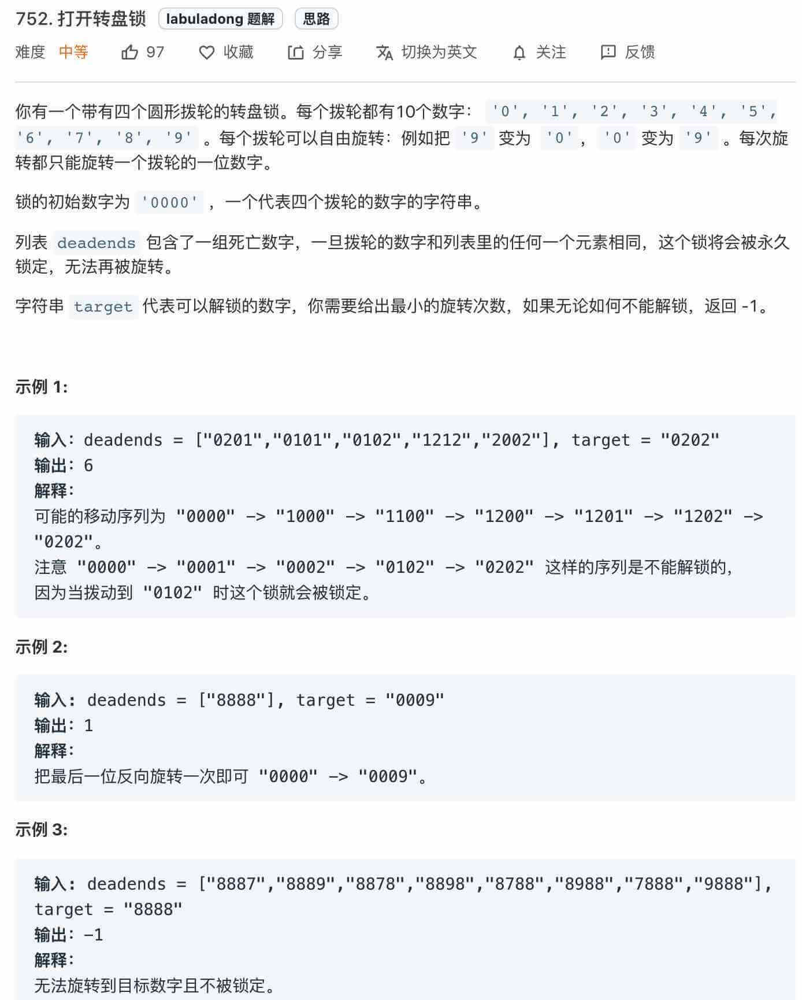

# 搜索 1. BFS

Created: April 10, 2022 11:24 PM
Tags: 找最短路径

BFS相对DFS的最主要的区别是: BFS找到的路径一定是最短的, 但代价就是空间复杂度可能比DFS大很多.

## 算法框架

BFS问题的本质就是在一副**图**中找到从起点start到终点traget的最近距离.

→ 可以有各种变体: 

1. 走迷宫，有的格子是围墙不能走，从起点到终点的最短距离是多少？如果这个迷宫带「传送门」可以瞬间传送呢？
2. 再比如说两个单词，要求你通过某些替换，把其中一个变成另一个，每次只能替换一个字符，最少要替换几次？
3. 再比如说连连看游戏，两个方块消除的条件不仅仅是图案相同，还得保证两个方块之间的最短连线不能多于两个拐点。你玩连连看，点击两个坐标，游戏是如何判断它俩的最短连线有几个拐点的？

BFS 框架:

```java
// 计算从起点 start 到终点 target 的最近距离
int BFS(Node start, Node target) {
    Queue<Node> q; // 核心数据结构
    Set<Node> visited; // 避免走回头路
    
    q.offer(start); // 将起点加入队列
    visited.add(start);
    int step = 0; // 记录扩散的步数

    while (q not empty) {
        int sz = q.size();
        /* 将当前队列中的所有节点向四周扩散 */
        for (int i = 0; i < sz; i++) {
            Node cur = q.poll();
            /* 划重点：这里判断是否到达终点 */
            if (cur is target)
                return step;
            /* 将 cur 的相邻节点加入队列 */
            for (Node x : cur.adj()) {
                if (x not in visited) {
                    q.offer(x);
                    visited.add(x);
                }
            }
        }
        /* 划重点：更新步数在这里 */
        step++;
    }
}
```

### Tree

1. **Minimum Depth of Binary Tree**

```java
class Solution {
    public int minDepth(TreeNode root) {
        if (root == null) return 0;
        Queue<TreeNode> q = new LinkedList<>();
        
        q.offer(root);
        //root 本身就是一层, depth 初始1
        int depth = 1;
        
        while(!q.isEmpty()) {
            int sz = q.size();
            for (int i = 0; i < sz; i++) {
                TreeNode cur = q.poll();
                // 判断是否到终点
                if (cur.left == null && cur.right == null) {
                    return depth;
                }
                // cur的相邻节点, 在Tree里即左右节点
                if (cur.left !=null) {
                    q.offer(cur.left);
                }
                if (cur.right != null) {
                    q.offer(cur.right);
                }
            }
            // 这里增加步数
            depth++;
        }
        return depth;
    }
}
```

### 字符串



**第一步，我们不管所有的限制条件，不管 `deadends` 和 `target` 的限制，就思考一个问题：如果让你设计一个算法，穷举所有可能的密码组合，你怎么做**？

穷举呗，再简单一点，如果你只转一下锁，有几种可能？总共有 4 个位置，每个位置可以向上转，也可以向下转，也就是有 8 种可能对吧。

比如说从 `"0000"` 开始，转一次，可以穷举出 `"1000", "9000", "0100", "0900"...` 共 8 种密码。然后，再以这 8 种密码作为基础，对每个密码再转一下，穷举出所有可能…

**仔细想想，这就可以抽象成一幅图，每个节点有 8 个相邻的节点**，又让你求最短距离，这不就是典型的 BFS 嘛，框架就可以派上用场了，先写出一个「简陋」的 BFS 框架代码再说别的：

**基础框架:**

```java
class Solution {
    public int openLock(String[] deadends, String target) {
        Queue<String> q = new LinkedList<>();
        q.offer("0000");
        
        while (!q.isEmpty()) {
            int sz = q.size();
            for (int i = 0; i < sz; i++) {
                String cur = q.poll();
                // 判断是否到达终点
                /////////////////////
                
                for (int j = 0; j < 4; j++) {
                    String up = plusOne(cur, j);
                    String down = minusOne(cur, j);
                    q.offer(up);
                    q.offer(down);
                }
            }
            // 增加步数
        }
        
    }
    
    // 将s[j] 向上拨动一次
    String plusOne(String s, int j) {
        char[] ch = s.toCharArray();
        if (ch[j] == '9'){
            ch[j] = '0';
        } else {
            ch[j] += 1;
        }
        return new String(ch);
    }
    
    // 将s[j] 向下拨动一次
    String minusOne(String s, int j) {
        char[] ch = s.toCharArray();
        if (ch[j] == '0') {
            ch[j] = '9';
        } else {
            ch[j] -= 1;
        }
        return new String(ch);
    }
    
}
```

**这段 BFS 代码已经能够穷举所有可能的密码组合了，但是显然不能完成题目，有如下问题需要解决**：

1、会走回头路。比如说我们从 `"0000"` 拨到 `"1000"`，但是等从队列拿出 `"1000"` 时，还会拨出一个 `"0000"`，这样的话会产生死循环。

2、没有终止条件，按照题目要求，我们找到 `target` 就应该结束并返回拨动的次数。

3、没有对 `deadends` 的处理，按道理这些「死亡密码」是不能出现的，也就是说你遇到这些密码的时候需要跳过。

最终:

```java
class Solution {
    public int openLock(String[] deadends, String target) {
        // 记录需要跳过的死亡密码
        Set<String> deads = new HashSet<>();
        for (String s : deadends) deads.add(s);
        // 记录已经穷举过的密码, 防止走回头路
        Set<String> visited = new HashSet<>();
        
        
        Queue<String> q = new LinkedList<>();
        int step = 0;
        q.offer("0000");
        visited.add("0000");
        
        while (!q.isEmpty()) {
            int sz = q.size();
            for (int i = 0; i < sz; i++) {
                String cur = q.poll();
                // 判断是否到达终点
                /////////////////////
                if (deads.contains(cur)) {
                    continue;
                } 
                if (cur.equals(target)) {
                    return step;
                }
                
                for (int j = 0; j < 4; j++) {
                    String up = plusOne(cur, j);
                    if (!visited.contains(up)) {
                        q.offer(up);
                        visited.add(up);
                    }
                    String down = minusOne(cur, j);
                    if (!visited.contains(down)) {
                        q.offer(down);
                        visited.add(down);
                    }
                }
            }
            // 增加步数
            step++;
        }
        // 如果穷举完还没找到, 那就是找不到
        return -1;
        
    }
    
    // 将s[j] 向上拨动一次
    String plusOne(String s, int j) {
        char[] ch = s.toCharArray();
        if (ch[j] == '9'){
            ch[j] = '0';
        } else {
            ch[j] += 1;
        }
        return new String(ch);
    }
    
    // 将s[j] 向下拨动一次
    String minusOne(String s, int j) {
        char[] ch = s.toCharArray();
        if (ch[j] == '0') {
            ch[j] = '9';
        } else {
            ch[j] -= 1;
        }
        return new String(ch);
    }
    
}
```

### 最短单词路径

```java
class Solution {
    public int ladderLength(String beginWord, String endWord, List<String> wordList) {
        Queue<String> q = new LinkedList<>(); // 核心数据结构
        Set<String> visited = new HashSet<>(); // 避免走回头路
        
        q.offer(beginWord);
        visited.add(beginWord);
        int step = 0;
        
        while (!q.isEmpty()) {
            int sz = q.size();
            for (int i = 0; i < sz; i++) {
                String cur = q.poll();
                // 是否到终点 
                if (cur.equals(endWord)) {
                    return step + 1;
                }
                for (String word : wordList) {
                    if ((!visited.contains(word)) && isValid(cur, word)) {
                        q.offer(word);
                        visited.add(word);
                    }
                }
            }
            step++;
        }
        return 0;
        
    }
    
    private boolean isValid(String s1, String s2) {
    int diffCnt = 0;
    for (int i = 0; i < s1.length() && diffCnt <= 1; i++) {
        if (s1.charAt(i) != s2.charAt(i)) {
            diffCnt++;
        }
    }
    return diffCnt == 1;
}
}
```

### ****计算在网格中从原点到特定点的最短路径长度****

- 用`direction = {{1, -1}, {1, 0}, {1, 1}, {0, -1}, {0, 1}, {-1, -1}, {-1, 0}, {-1, 1}};` 表示上下左右的选择
- 用`Pair<Integer, Integer>`

```java
class Solution {
    public int shortestPathBinaryMatrix(int[][] grids) {
        if (grids == null || grids.length == 0 || grids[0].length == 0 || grids[0][0] == 1) {
            return -1;
        }
        int[][] direction = {{1, -1}, {1, 0}, {1, 1}, {0, -1}, {0, 1}, {-1, -1}, {-1, 0}, {-1, 1}};
        int m = grids.length, n = grids[0].length;
        Queue<Pair<Integer, Integer>> queue = new LinkedList<>();
        queue.add(new Pair<>(0, 0));
        int pathLength = 0;
        
        
        while (!queue.isEmpty()) {
            int size = queue.size();

            for (int i = 0; i < size; i++) {
                Pair<Integer, Integer> cur = queue.poll();
                int cr = cur.getKey(), cc = cur.getValue();
                
                if (cr == m - 1 && cc == n - 1) {
                    return pathLength + 1;
                }
                
                for (int[] d : direction) {
                    int nr = cr + d[0], nc = cc + d[1];
                    if (nr < 0 || nr >= m || nc < 0 || nc >= n || grids[nr][nc] == 1) {
                        continue;
                    } 
                    queue.add(new Pair<>(nr, nc));
                    grids[nr][nc] = 1;
                }
            }
            pathLength++;
        }
        
        return -1;
    }
}
```

### 组成整数的最小平方数数量

思路刁钻:

可以将每个整数看成图中的一个节点，如果两个整数之差为一个平方数，那么这两个整数所在的节点就有一条边。

要求解最小的平方数数量，就是求解从节点 n 到节点 0 的最短路径。

```java
class Solution {
    public int numSquares(int n) {
        List<Integer> squares = generateSquares(n);
        Queue<Integer> queue = new LinkedList<>();
        boolean[] marked = new boolean[n+1];
        
        queue.add(n);
        marked[n] = true;
        int step = 0;
        
        while (!queue.isEmpty()) {
            int size = queue.size();
            
            for (int i = 0; i < size; i++) {
                int cur = queue.poll();
                
                if (cur == 0) {
                    return step;
                }
                
                for (int s : squares) {
                    if (cur - s < 0) {
                        break;
                    }
                    if (marked[cur - s] == false) {
                        queue.add(cur - s);
                        marked[cur - s] = true;
                    }
                }
                
            }
            step++;
        }
        return -1;
        
    }
    
    /**
	 * 生成小于 n 的平方数序列
	 * @return 1,4,9,...
	 */
	private List<Integer> generateSquares(int n) {
	    List<Integer> squares = new ArrayList<>();
	    int square = 1;
	    int diff = 3;
	    while (square <= n) {
	        squares.add(square);
	        square += diff;
	        diff += 2;
	    }
	    return squares;
	}
}
```