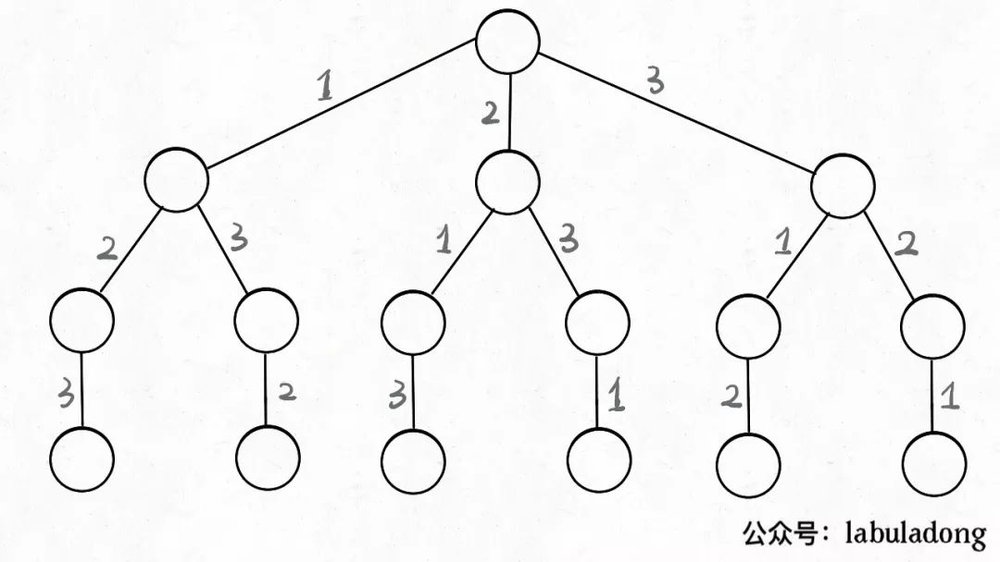
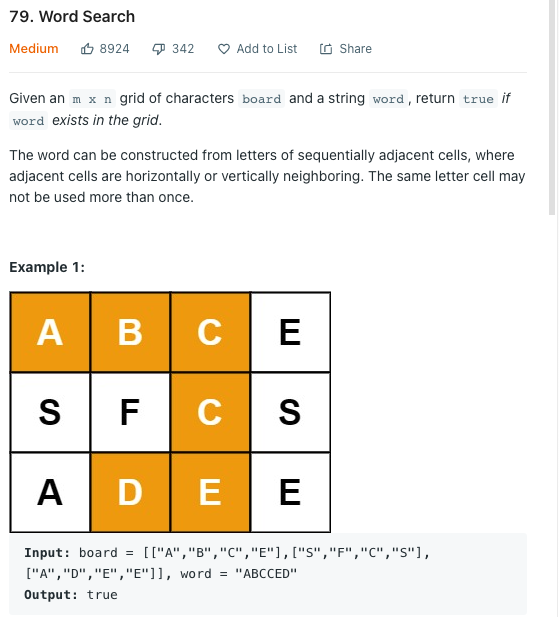

# 搜索 3. 回溯算法 Backtracing

题目列表

#### 组合

77. 组合（元素无重不可复选） 
78. 组合(元素无重不可复选)
79. 组合总和II (元素无重可复选)
80. 组合总和 (元素可重不可复选)

17. 电话号码的字母组合

#### 子集(Subset)

78. 子集(无重不可复选) 

90. 子集(可重不可复选)

#### 排列

46. 排列(元素无重不可复选)
47. 排列(元素可重不可复选)

#### 分割

131. 分割回文串			

93. 复原IP地址

#### 棋盘问题

51. <u>N皇后</u>

37. <u>解数独</u>

#### 其他

491. 递增子序列

332. <u>重新安排行程</u>


## 基本模板

```java
class Solution {
    List<List<Integer>> res = new LinkedList<>();
    LinkedList<Integer> track = new LinkedList<>();
    // 要不要used?
    public List<List<Integer>> subsets(int[] nums) {
        backtrack(nums);
        return res;
    }
    
    private void backtrack(int[] nums) {
        // 结束条件? 
        res.add(new LinkedList<>(track));
        
        for (int i = 0; i < nums.length; i++) {  // for 从0开始还是传入start?
            //
            
            track.add(nums[i]);
            //
            
            backtrack(nums);
            
            track.removeLast();
            
        }
    }
}
```

### Java 中的数据结构

#### 字符串

```java
StringBuilder track = new StringBuilder();
res.add(track.toString());
track.append(c);
track.deleteCharAt(track.length() - 1);
```


## 1. 组合子集排列问题

### 元素无重不可复选 

#### 子集 78

#### 组合 77 

#### 全排列46 

### 元素可重不可复选

#### 子集 II 90

以`nums = [1, 2, 2]` 为例, 为了区别两个`2`是不同的元素, 写作`nums = [1, 2, 2']`

需要进行**剪枝**, 如果一个节点有多条值相同的树枝相邻, 则只遍历第一条, 剩下的都剪掉, 不要去遍历.

体现在代码上: 

- 先进行排序, 让相同的元素靠在一起, 如果发现 nums[i] == nums[i-1], 则跳过.

#### 全排列 47

比起之前的全排列, 正确解法添加了两处不同: 

- 对nums进行了排序
- 添加了一句额外的剪枝逻辑 `if (i > 0 && nums[i] == nums[i - 1] && !used[i-1])`

理解`!used[i-1]` : **保持相同元素在排列的相对位置保持不变**

比如说 `nums = [1,2,2']` 这个例子，我保持排列中 `2` 一直在 `2'` 前面。

这样的话，你从上面 6 个排列中只能挑出 3 个排列符合这个条件：

```java
[ [1,2,2'],[2,1,2'],[2,2',1] ]
```

**标准全排列算法之所以出现重复，是因为把相同元素形成的排列序列视为不同的序列，但实际上它们应该是相同的；而如果固定相同元素形成的序列顺序，当然就避免了重复**。

**当出现重复元素时，比如输入 `nums = [1,2,2',2'']`，`2'` 只有在 `2` 已经被使用的情况下才会被选择，同理，`2''` 只有在 `2'` 已经被使用的情况下才会被选择，这就保证了相同元素在排列中的相对位置保证固定**。


### 元素无重可复选

#### 组合总和 39

这道题说是组合问题，实际上也是子集问题：`candidates` 的哪些子集的和为 `target`？

想解决这种类型的问题，也得回到回溯树上，**我们不妨先思考思考，标准的子集/组合问题是如何保证不重复使用元素的**？

答案在于 `backtrack` 递归时输入的参数 `start`：

```java
// 无重组合的回溯算法框架
void backtrack(int[] nums, int start) {
    for (int i = start; i < nums.length; i++) {
        // ...
        // 递归遍历下一层回溯树，注意参数
        backtrack(nums, i + 1);
        // ...
    }
}
```

这个 `i` 从 `start` 开始，那么下一层回溯树就是从 `start + 1` 开始，从而保证 `nums[start]` 这个元素不会被重复使用

那么反过来，如果我想让每个元素被重复使用，我只要把 `i + 1` 改成 `i` 即可：

```java
// 可重组合的回溯算法框架
void backtrack(int[] nums, int start) {
    for (int i = start; i < nums.length; i++) {
        // ...
        // 递归遍历下一层回溯树，注意参数
        backtrack(nums, i);
        // ...
    }
}
```

这相当于给之前的回溯树添加了一条树枝，在遍历这棵树的过程中，一个元素可以被无限次使用：

当然，这样这棵回溯树会永远生长下去，所以我们的递归函数需要设置合适的 base case 以结束算法，即路径和大于 `target` 时就没必要再遍历下去了。


## 2. 分割问题

1. 考虑好辅助的函数, 使得满足分割条件

2. 横向的遍历 for, i为右边的index, 为right

#### 131. 分割回文串

```java
class Solution {
    List<List<String>> res = new LinkedList<>();
    LinkedList<String> track = new LinkedList<>();
    public List<List<String>> partition(String s) {
        if (s.isEmpty()) {
            return res;
        }
        backtrack(s, 0);
        return res;
    }
    private void backtrack(String s, int left) {
        // 结束条件
        if (left == s.length()) {
            res.add(new LinkedList<>(track));
            return;
        }
        for (int right = left; right < s.length(); right++) {
            if (isPalindrome(s, left, right)) { // if this part is palindrome 
                track.add(s.substring(left, right + 1));
                backtrack(s, right + 1);
                track.removeLast();
            } 
        }
    }
    boolean isPalindrome(String s, int left, int right) {
        while (left <= right) {
            if (s.charAt(left) != s.charAt(right)) return false;
            left++;
            right--;
        }
        return true;
    }
}
```


#### 93. 复原IP地址

```java
class Solution {
    List<String> res = new ArrayList<>();
    StringBuilder track= new StringBuilder();
    public List<String> restoreIpAddresses(String s) {
        
        backtrack(s, 0, 0);
        return res;
    }
    
    private void backtrack(String s, int dots, int index) {
        if (dots == 3) {
            if (isValid(s.substring(index))) {
                track.append("." + s.substring(index));
                res.add(track.toString());
            }
            return;
        }
        
        for (int right = index; right < s.length(); right++) {
            if (isValid(s.substring(index, right + 1))) {
                int length = track.length();
                if (dots == 0) {
                    track.append(s.substring(index, right + 1));
                } else {
                    track.append("." + s.substring(index, right+ 1));
                }
                backtrack(s, dots + 1, right+1);
                track.setLength(length);
            }
        }
    }
    
    private boolean isValid(String s) {
        if (s.length() > 1 && s.charAt(0) == '0') return false;
        if (s.length() == 0 || s.length() > 3) return false;
        if (Integer.valueOf(s) > 255) return false;
        
        return true;
    }
} 
```


### 3. 子增子序列

- 类似于去重的子集问题, 但是, 子序列 不能改变原有nums的顺序, 因此, 原来的去重问题不能解

- 这里的去重 就是每到新的一层都会建立一个新的used数组(之前一层会清空) ,那就是在for循环前面建立新的used数组即可.


```java
class Solution {
    List<List<Integer>> res = new LinkedList<>();
    LinkedList<Integer> track = new LinkedList<>();
    public List<List<Integer>> findSubsequences(int[] nums) {
        backtrack(nums, 0);
        return res;
    }
    
    private void backtrack(int[] nums, int start) {
        // end condition
        if (track.size() > 1) {
            res.add(new LinkedList(track));
        }
        int[] used = new int[201]; // 只定义本层 到了新的一层会被清空
        
        for (int i = start; i < nums.length; i++) {
            if (!track.isEmpty() && nums[i] < track.get(track.size() - 1) || (used[nums[i] + 100] == 1)) {
                continue;
            }
            used[nums[i] + 100] = 1;
            track.add(nums[i]);
            
            backtrack(nums, i+1);
            
            track.removeLast();
        }
        //     4767
    }
}
```


-------------------------------

Created: April 10, 2022 11:21 PM
Tags: N皇后, 排列/组合/子集

**回溯一定记得 在框架里, for(int i = ..) 里面要用i 而不是start!!**

### 算法框架

解决一个回溯问题, 实际上就是一个决策树的遍历过程. 重点思考三个问题:

1. 路径: 也就是已经做出的选择
2. 选择列表: 也就是你当前可以做的选择
3. 结束条件: 也就是到底决策树底层, 无法再做选择的条件

---

框架: 

```java
result = []
def backtrack(路径, 选择列表):
	if 满足结束条件:
		result.add(路径)
		return

	for 选择 in 选择列表: // 左右
		做选择
		backtrack(路径, 选择列表) //上下
		撤销选择
```

其核心就是for循环里面的递归, 在递归调用之前**做选择**, 在递归调用之后**撤销选择.**

### 1. 全排列问题

> 为了简单起见, 这次讨论的全排列问题不包含重复的数字
> 

e.g. [1, 2, 3] 全排列,  有如下回溯树:



只要从根遍历这棵树, 记录路径上的数字, 其实就是所有的全排列. **我们把这棵树称为回溯算法的决策树. →** 因为你在每个节点上其实都在做决策.


以此为例, [2]就是**路径**, 记录你已经做过的选择;

[1, 3]就是**选择列表**, 表示你当前可以做出的选择;

**结束条件**: 就是遍历到树的底层,在这里就是选择列表为空的时候. 


**我们定义的`backtrack`函数其实就像一个指针，在这棵树上游走，同时要正确维护每个节点的属性，每当走到树的底层，其「路径」就是一个全排列**

***各种搜索问题其实都是树的遍历问题, 多叉树的遍历框架:***

```java
void traverse(TreeNode root) {
	for (TreeNode child : root.children)
		// 前序遍历需要的操作
		traverse(child);
		// 后序遍历需要的操作
}
```


全排列代码:

```java
List<List<Integer>> res = new LinkedList<>();

// 主函数, 输入一组不重复的数字, 返回它们的全排列
List<List<Integer>> permute(int[] nums) {
	// 记录路径
	LinkedList<Integer> track = new LinkedList<>();
	backtrack(num, track);
	return res;
}

//路径: 记录在 track中
// 选择列表: nums中不存在与track的那些元素
// 结束条件: nums中的元素全都在tracck中出现
void backtrack(int[] nums, LinkedList<Integer> track) {
	// 触发结束条件
	if (track.size() == nums.length) {
		res.add(new LinkedList(track));
		return;
	}

	for (int i = 0; i < nums.length; i++) {
		// 排除不合法的选择
		if (track.contains(nums[i])) continue;
		
		// 做选择
		track.add(nums[i]);
		
		//进入下一层决策树
		backtrack(nums, track);

		// 取消选择
		track.removeLast();
	}
}
```

### 2. N皇后

给一个N * N的棋盘, 让你放置N个皇后, 使得它们不能互相攻击.

皇后可以攻击同一行, 同一列, 左上右下右上右下四个方向的任意单位.

```java
class Solution {
    List<List<String>> res = new ArrayList<>();
    public List<List<String>> solveNQueens(int n) {
        // "." 表示空, “Q"表示皇后, 初始化棋盘
        char[][] board = new char[n][n];
        for (char[] c : board) {
            Arrays.fill(c, '.');
        }
        backtrack(board, 0);
        return res;
    }
    
    // 路径: board中小于row的那些行都已经成功放置了皇后
    // 选择列表: 第row行的所有列都是放置皇后的选择
    // 结束条件: row超过 board最后一行
    void backtrack(char[][] board, int row) {
        // 触发结束条件
        if (row == board.length) {
            res.add(charToList(board));
            return;
        }
        
        int n = board[row].length;
        // 在当前行的每一列都可能放置皇后
        for (int col = 0; col < n; col++) {
            // 排除不合法选择
            if (!isValid(board, row, col)) {
                continue;
            }
            //做选择
            board[row][col] = 'Q';
            
            // 进入下一行放皇后
            backtrack(board, row + 1);
            
            //撤销选择
            board[row][col] = '.';
        }
    }
    
    // 判断是否可以在board[row][col] 放置皇后
    public boolean isValid(char[][] board, int row, int col) {
        int n = board.length;
        // 检查列是否有皇后冲突
        for (int i = 0; i < n; i++) {
            if (board[i][col] == 'Q') {
                return false;
            }
        }
        //检查右上方是否有皇后冲突
        for (int i = row - 1, j = col + 1; i >= 0 && j < n; i--, j++) { // 不断往右上探索, 确保每个皇后位置都没问题
            if (board[i][j] == 'Q') {
                return false;
            }
        }
        
        // 检查左上方是否有皇后冲突
        for (int i = row - 1, j = col - 1; i >= 0 && j >= 0; i--, j--) {
            if (board[i][j] == 'Q') {
                return false;
            }
        }
        return true;
    }
    
    public List charToList(char[][] board) {
        List<String> list = new ArrayList<>();

        for (char[] c : board) {
            list.add(String.copyValueOf(c));
        }
        return list;
    }
}
```

按照 N 皇后问题的描述，我们为什么不检查左下角，右下角和下方的格子，只检查了左上角，右上角和上方的格子呢？

→ 

因为皇后是一行一行从上往下放的，所以左下方，右下方和正下方不用检查（还没放皇后）；因为一行只会放一个皇后，所以每行不用检查。也就是最后只用检查上面，左上，右上三个方向。

函数 `backtrack` 依然像个在决策树上游走的指针，通过 `row` 和 `col` 就可以表示函数遍历到的位置，通过 `isValid` 函数可以将不符合条件的情况剪枝：

# 1. 按数据结构

### 1.1 返回List<String>

Leetcode : 17, 93, 131

**创建**

```java
List<String> res = new ArrayList<>();
StringBuilder track= new StringBuilder();
```

**主函数**

最好注意一下String == null 或者长度为0的情况;

**base case的选择:**

- 长度如果有要求, 最简单, 按要求即可.
- 如果是将String划分成不同区域, 可以考虑指针不断向右 让ptr == string.length(); (如leetcode 131) ****

### 1.2 返回<List<List<Integer>>

- 各种排列组合子集, 重复/非重复问题见下.

创建

```java
List<List<Integer>> res = new LinkedList<>();
LinkedList<Integer> track = new LinkedList<>();
```

base case重点注意:

```java
if (track.size() == nums.length) {
	res.add(new LinkedList<>(track)); // 不能add track, 而是要新创建一个LinkedList!!
	return;
}
```

### 1.3 矩阵问题

- 常使用 visited[][] 来表示是否遍历过 (Leetcode 79)
    - 数独和N皇后是改board值
- 数独定位很tricky
    - if `(board[3 * (row / 3) + i / 3][3 * (col / 3) + i % 3] == num) return false;`

# 2. 按题型分

## 2.1 排列/组合/子集问题

无论是排列, 组合 还是子集问题, 简单说无非就是让你从序列nums中以给定规则取若干元素, 主要有以下变体:

1. 元素无重不可复选, 即`nums`中的元素都是唯一的, 每个元素最多只能被使用一次, 这也是最基本的形式.
2. 元素可重不可复选
3. 元素无重可复选


### 1. 子集(元素无重不可复选)

1. Subsets

Given an integer array `nums` of **unique** elements, return *all possible subsets (the power set)*.

The solution set **must not** contain duplicate subsets. Return the solution in **any order**.

**Example 1:**

```
Input: nums = [1,2,3]
Output: [[],[1],[2],[1,2],[3],[1,3],[2,3],[1,2,3]]

```


```java
List<List<Integer>> res = new LinkedList<>();
// 记录回溯算法的递归路径
LinkedList<Integer> track = new LinkedList<>();

// 主函数
public List<List<Integer>> subsets(int[] nums) {
    backtrack(nums, 0);
    return res;
}

// 回溯算法核心函数，遍历子集问题的回溯树
void backtrack(int[] nums, int start) {

    // 前序位置，每个节点的值都是一个子集
    res.add(new LinkedList<>(track));
    
    // 回溯算法标准框架
    for (int i = start; i < nums.length; i++) {
        // 做选择
        track.addLast(nums[i]);
        // 通过 start 参数控制树枝的遍历，避免产生重复的子集
        backtrack(nums, i + 1);
        // 撤销选择
        track.removeLast();
    }
}
```

### 2. 组合(元素无重不可复选)

```java
List<List<Integer>> res = new LinkedList<>();
// 记录回溯算法的递归路径
LinkedList<Integer> track = new LinkedList<>();

// 主函数
public List<List<Integer>> combine(int n, int k) {
    backtrack(1, n, k);
    return res;
}

void backtrack(int start, int n, int k) {
    // base case
    if (k == track.size()) {
        // 遍历到了第 k 层，收集当前节点的值
        res.add(new LinkedList<>(track));
        return;
    }
    
    // 回溯算法标准框架
    for (int i = start; i <= n; i++) {
        // 选择
        track.addLast(i);
        // 通过 start 参数控制树枝的遍历，避免产生重复的子集
        backtrack(i + 1, n, k);
        // 撤销选择
        track.removeLast();
    }
}
```

### 3. 排列(元素无重不可复选)

见上全排列

### 4. 子集/组合(元素可重不可复选)

力扣第 90 题「 [子集 II](https://leetcode-cn.com/problems/subsets-ii)」就是这样一个问题：

给你一个整数


```java
List<List<Integer>> res = new LinkedList<>();
LinkedList<Integer> track = new LinkedList<>();

public List<List<Integer>> subsetsWithDup(int[] nums) {
    // 先排序，让相同的元素靠在一起
    Arrays.sort(nums);
    backtrack(nums, 0);
    return res;
}

void backtrack(int[] nums, int start) {
    // 前序位置，每个节点的值都是一个子集
    res.add(new LinkedList<>(track));
    
    for (int i = start; i < nums.length; i++) {
        // 剪枝逻辑，值相同的相邻树枝，只遍历第一条
        if (i > start && nums[i] == nums[i - 1]) {
            continue;
        }
        track.addLast(nums[i]);
        backtrack(nums, i + 1);
        track.removeLast();
    }
}
```

**我们说了组合问题和子集问题是等价的**
所以我们直接看一道组合的题目吧，这是力扣第 40 题「 [组合总和 II](https://leetcode-cn.com/problems/combination-sum-ii)

说这是一个组合问题，其实换个问法就变成子集问题了：请你计算 `candidates`中所有和为 `target`的子集。

对比子集问题的解法，只要额外用一个 `trackSum`变量记录回溯路径上的元素和，然后将 base case 改一改即可解决这道题：

```java
List<List<Integer>> res = new LinkedList<>();
// 记录回溯的路径
LinkedList<Integer> track = new LinkedList<>();
// 记录 track 中的元素之和
int trackSum = 0;

public List<List<Integer>> combinationSum2(int[] candidates, int target) {
    if (candidates.length == 0) {
        return res;
    }
    // 先排序，让相同的元素靠在一起
    Arrays.sort(candidates);
    backtrack(candidates, 0, target);
    return res;
}

// 回溯算法主函数
void backtrack(int[] nums, int start, int target) {
    // base case，达到目标和，找到符合条件的组合
    if (trackSum == target) {
        res.add(new LinkedList<>(track));
        return;
    }
    // base case，超过目标和，直接结束
    if (trackSum > target) {
        return;
    }

    // 回溯算法标准框架
    for (int i = start; i < nums.length; i++) {
        // 剪枝逻辑，值相同的树枝，只遍历第一条
        if (i > start && nums[i] == nums[i - 1]) {
            continue;
        }
        // 做选择
        track.add(nums[i]);
        trackSum += nums[i];
        // 递归遍历下一层回溯树
        backtrack(nums, i + 1, target);
        // 撤销选择
        track.removeLast();
        trackSum -= nums[i];
    }
}
```

### 5. 排序(元素可重不可复选)

解法代码只有两处不同：

1、对 `nums` 进行了排序。

2、添加了一句额外的剪枝逻辑。

类比输入包含重复元素的子集/组合问题，你大概应该理解这么做是为了防止出现重复结果。但是注意排列问题的剪枝逻辑，和子集/组合问题的剪枝逻辑略有不同：新增了 `!used[i - 1]` 的逻辑判断。这个地方理解起来就需要一些技巧性了，且听我慢慢到来。为了方便研究，依然把相同的元素用上标 `'` 以示区别。假设输入为 `nums = [1,2,2']`，标准的全排列算法会得出如下答案：

```
[
    [1,2,2'],[1,2',2],
    [2,1,2'],[2,2',1],
    [2',1,2],[2',2,1]
]

```

显然，这个结果存在重复，比如 `[1,2,2']` 和 `[1,2',2]` 应该只被算作同一个排列，但被算作了两个不同的排列。所以现在的关键在于，如何设计剪枝逻辑，把这种重复去除掉？

**答案是，保证相同元素在排列中的相对位置保持不变**。比如说 `nums = [1,2,2']` 这个例子，我保持排列中 `2` 一直在 `2'` 前面。这样的话，你从上面 6 个排列中只能挑出 3 个排列符合这个条件：

```java
[ [1,2,2'],[2,1,2'],[2,2',1] ]
```

这也就是正确答案。

进一步，如果 `nums = [1,2,2',2'']`，我只要保证重复元素 `2` 的相对位置固定，比如说 `2 -> 2' -> 2''`，也可以得到无重复的全排列结果。

仔细思考，应该很容易明白其中的原理：

**标准全排列算法之所以出现重复，是因为把相同元素形成的排列序列视为不同的序列，但实际上它们应该是相同的；而如果固定相同元素形成的序列顺序，当然就避免了重复**。

## 2.2 回溯属于DFS

Backtracking（回溯）属于 DFS。

- 普通 DFS 主要用在 **可达性问题** ，这种问题只需要执行到特点的位置然后返回即可。
- 而 Backtracking 主要用于求解 **排列组合** 问题，例如有 { 'a','b','c' } 三个字符，求解所有由这三个字符排列得到的字符串，这种问题在执行到特定的位置返回之后还会继续执行求解过程。

因为 Backtracking 不是立即返回，而要继续求解，因此在程序实现时，需要注意对元素的标记问题：

- 在访问一个新元素进入新的递归调用时，需要将新元素标记为已经访问，这样才能在继续递归调用时不用重复访问该元素；
- 但是在递归返回时，需要将元素标记为未访问，因为只需要保证在一个递归链中不同时访问一个元素，可以访问已经访问过但是不在当前递归链中的元素。

### 回溯与二叉树 ( 好像没办法套用在前面的模版里)

1.  Binary Tree Paths


```
Input: root = [1,2,3,null,5]
Output: ["1->2->5","1->3"]
```

```java
class Solution {
    List<String> res = new ArrayList<>();
    LinkedList<String> track = new LinkedList<>();
    public List<String> binaryTreePaths(TreeNode root) {
        backtrack(root);
        return res;
    }
    
    private void backtrack(TreeNode root) {
        track.add(String.valueOf(root.val));
        if (root == null) return;
        if (root.left == null && root.right == null) {
            res.add(String.join("->", track));
            return;
        }
        
        if (root.left != null) {
            backtrack(root.left);
            track.removeLast();
        }
        if (root.right != null) {
            backtrack(root.right);
            track.removeLast();
        }
                    
    }
}
```

### 在矩阵中寻找字符串



```java
public class Solution {

    private static final int[][] DIRECTIONS = {{-1, 0}, {0, -1}, {0, 1}, {1, 0}};
    private int rows;
    private int cols;
    private int len;
    private boolean[][] visited;
    private char[] charArray;
    private char[][] board;

    public boolean exist(char[][] board, String word) {
        rows = board.length;
        if (rows == 0) {
            return false;
        }
        cols = board[0].length;
        visited = new boolean[rows][cols];

        this.len = word.length();
        this.charArray = word.toCharArray();
        this.board = board;
        for (int i = 0; i < rows; i++) {
            for (int j = 0; j < cols; j++) {
                if (dfs(i, j, 0)) {
                    return true;
                }
            }
        }
        return false;
    }

    private boolean dfs(int x, int y, int begin) {
        if (begin == len - 1) {
            return board[x][y] == charArray[begin];
        }
        if (board[x][y] == charArray[begin]) {
            visited[x][y] = true;
            for (int[] direction : DIRECTIONS) {
                int newX = x + direction[0];
                int newY = y + direction[1];
                if (inArea(newX, newY) && !visited[newX][newY]) {
                    if (dfs(newX, newY, begin + 1)) {
                        return true;
                    }
                }
            }
            visited[x][y] = false;
        }
        return false;
    }

    private boolean inArea(int x, int y) {
        return x >= 0 && x < rows && y >= 0 && y < cols;
    }
}
```

偏移量数组在二维平面内是经常使用的，可以把它的设置当做一个技巧，并且在这个问题中，偏移量数组内的 4 个偏移的顺序无关紧要；
说明：类似使用这个技巧的问题还有：「力扣」第 130 题：被围绕的区域、「力扣」第 200 题：岛屿数量。

### 17. ****数字键盘组合****

```
Input: digits = "23"
Output: ["ad","ae","af","bd","be","bf","cd","ce","cf"]
```

```java
class Solution {
    private static final String[] KEYS = {"", "", "abc", "def", "ghi", "jkl", "mno", "pqrs", "tuv", "wxyz"};
    List<String> res = new LinkedList<>();
    
    
    public List<String> letterCombinations(String digits) {
        if(digits == null || digits.length() == 0) {
            return res;
        }    
        backtracking(new StringBuilder(), digits);
        return res;
    }
    
    void backtracking(StringBuilder prefix, String digits) {
        if (prefix.length() == digits.length()) {
            res.add(prefix.toString());
            return;
        }
        
        int curDigits = digits.charAt(prefix.length()) - '0';
        String letters = KEYS[curDigits];
        for (char c : letters.toCharArray()) {
            prefix.append(c);
            backtracking(prefix, digits);
            prefix.deleteCharAt(prefix.length() - 1);
        }
    }
}
```

我们的选择列表就是 当前letter 的三个字符. 这是 左右方向

结束递归(上下) 就是 不断增长的prefix长度.

### **2. IP 地址划分**

93. Restore IP Addresses(Medium)

[Leetcode](https://leetcode.com/problems/restore-ip-addresses/description/) / [力扣](https://leetcode-cn.com/problems/restore-ip-addresses/description/)

```java
Given "25525511135",
return ["255.255.11.135", "255.255.111.35"].
```

```java
public List<String> restoreIpAddresses(String s) {
    List<String> addresses = new ArrayList<>();
    StringBuilder tempAddress = new StringBuilder();
    doRestore(0, tempAddress, addresses, s);
    return addresses;
}
//k是当前个数, 不能超过4个
private void doRestore(int k, StringBuilder tempAddress, List<String> addresses, String s) {
    if (k == 4 || s.length() == 0) {
        if (k == 4 && s.length() == 0) {
            addresses.add(tempAddress.toString());
        }
        return;
    }
    for (int i = 0; i < s.length() && i <= 2; i++) {
        if (i != 0 && s.charAt(0) == '0') {
            break;
        }
        String part = s.substring(0, i + 1);
        if (Integer.valueOf(part) <= 255) {
            if (tempAddress.length() != 0) {
                part = "." + part;
            }
            tempAddress.append(part);
            doRestore(k + 1, tempAddress, addresses, s.substring(i + 1));
            tempAddress.delete(tempAddress.length() - part.length(), tempAddress.length());
        }
    }
}
```

## 2.3 N 皇后及衍生问题

### 数独

1. 注意isValid函数 
2. N皇后是要全部解, 这个只需要一个解就好, 每当只需要一个解的, 我们可以考虑返回boolean

```java
class Solution {
    public void solveSudoku(char[][] board) {
        helper(board);
    }
    
    private boolean helper(char[][] board) {
        for (int i = 0; i < 9; i++) {
            for (int j = 0; j < 9; j++) {
                if (board[i][j] == '.') {
                    for (char num = '1'; num <= '9'; num ++){
                        if (isValid(board, i, j, num)) {
                            board[i][j] = num;
                            if (helper(board)) return true;
                            board[i][j] = '.';
                        }
                    }
                    return false;
                }
            }
        }
        return true;
    }
    
    private boolean isValid(char[][] board, int row, int col, char num){
        
        for (int i = 0; i < 9; i++) {
            // 同一列
            if (board[i][col] == num) return false;
            //同一行
            if (board[row][i] == num) return false;
            if (board[3 * (row / 3) + i / 3][3 * (col / 3) + i % 3] == num) return false;
        }
        return true;
    }
}
```